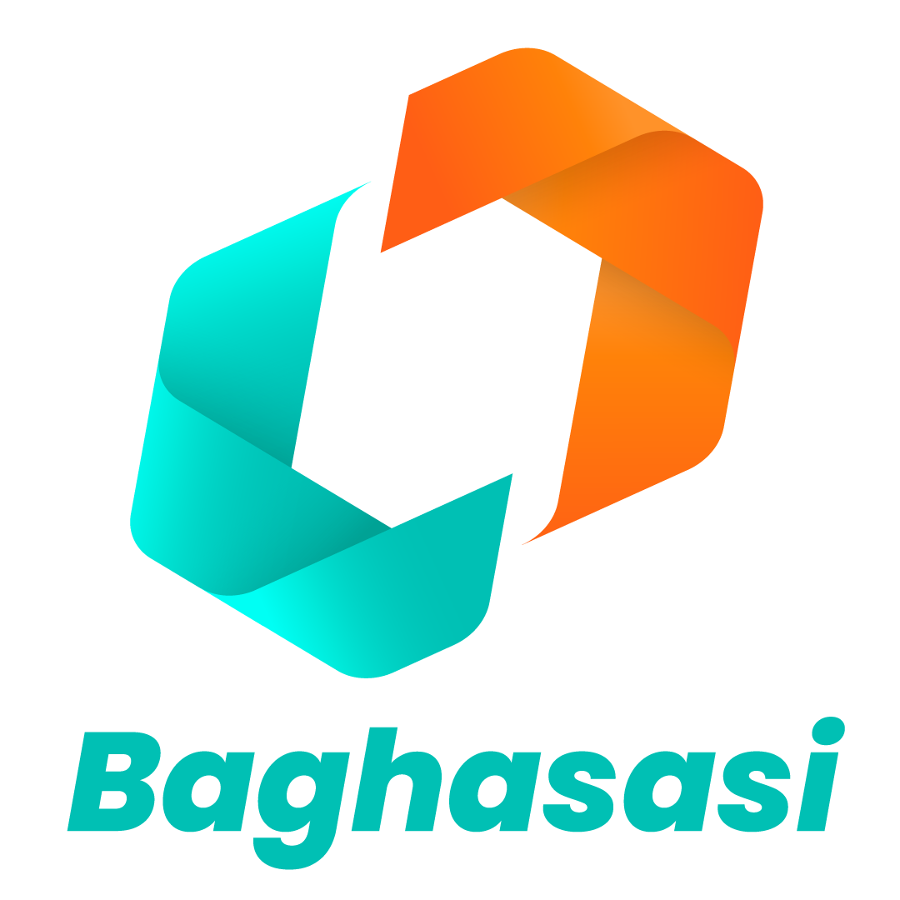

# 🌙 CakGup Microsite — Yayasan Baghasasi

<p align="center">
  
</p>

<p align="center">
  <strong>Microsite ringan, indah, dan mudah dikelola untuk kegiatan yayasan, dakwah, donasi, pendaftaran, serta publikasi link penting.</strong>
</p>

<p align="center">
  
  
  
  
</p>

---

## ✨ Tentang Aplikasi

**CakGup Microsite** adalah aplikasi microsite sederhana berbasis **GitHub Pages** dan **Google Apps Script** yang dibuat untuk memudahkan Yayasan Baghasasi dalam menyajikan berbagai link penting dalam satu halaman.

Aplikasi ini cocok digunakan untuk:

- halaman profil yayasan;
- pendaftaran kegiatan;
- informasi program kebaikan;
- penggalangan donasi;
- publikasi tautan WhatsApp, Instagram, YouTube, formulir, dokumen, dan lokasi;
- halaman kegiatan berulang yang membutuhkan link cepat dan mudah dibagikan.

> Aplikasi ini didedikasikan untuk ummat, agar teknologi sederhana dapat menjadi jalan kebaikan, kolaborasi, dan kemudahan dalam menyebarkan manfaat.

---

## 🕌 Filosofi

> **وَتَعَاوَنُوا عَلَى الْبِرِّ وَالتَّقْوَى**  
> *“Dan tolong-menolonglah kamu dalam kebajikan dan takwa.”*

Microsite ini dibangun dengan semangat gotong royong digital: sederhana, mudah digandakan, ringan dijalankan, dan dapat digunakan kembali oleh yayasan, komunitas, majelis, panitia kegiatan, maupun gerakan sosial lainnya.

---

## 🚀 Fitur Utama

### 🌐 Halaman Publik Microsite

- Tampilan bernuansa Islami dengan ornamen visual yang lembut.
- Profil Yayasan Baghasasi.
- Logo yayasan dengan animasi.
- Tagline dan narasi singkat yayasan.
- Teks ayat/hikmah Islami.
- Judul kegiatan yang dapat diubah dari admin.
- Daftar tombol link aktif yang dapat diurutkan.
- Ikon untuk WhatsApp, Instagram, YouTube, lokasi, donasi, formulir, dokumen, dan link umum.
- Tombol berbagi/share microsite.
- Musik nasyid ringan.
- Efek salju/ornamen lembut.
- Jadwal shalat harian untuk wilayah yang dikonfigurasi.
- Fallback mode jika API belum tersedia.

### 🔐 Dashboard Admin

Dashboard admin tersedia melalui:

```text
/u/admin
```

Fitur admin:

- login menggunakan password/token admin;
- menambah link baru;
- mengubah link yang sudah ada;
- mengaktifkan atau menonaktifkan link;
- menghapus link;
- mengatur warna tombol;
- mengatur urutan link;
- mengelola slug microsite;
- mengganti judul kegiatan;
- melihat statistik singkat jumlah link;
- preview tampilan microsite secara langsung.

### 🧩 Multi-Slug Microsite

Aplikasi mendukung banyak slug, misalnya:

```text
https://cakgup.github.io/u/baghasasi
https://cakgup.github.io/u/kegiatan-ramadhan
https://cakgup.github.io/u/donasi
https://cakgup.github.io/u/seminar
```

Setiap slug dapat memiliki daftar link berbeda.

### ⚙️ Backend Google Apps Script

Backend menggunakan Google Apps Script sebagai API sederhana untuk:

- login admin;
- mengambil data link publik;
- menyimpan link;
- menghapus link;
- mengaktifkan/menonaktifkan link;
- mengelola slug;
- menyimpan metadata microsite;
- menyimpan data pada Google Sheets.

### 📊 Database Google Sheets

Data disimpan dalam dua sheet utama:

```text
microsite_links
microsite_meta
```

Struktur kolom utama:

```text
microsite_links:
id, username, title, subtitle, url, icon, button_color, text_color, sort_order, is_active, created_at, updated_at

microsite_meta:
username, event_title, created_at, updated_at
```

### 🩺 Halaman Diagnostik API

Untuk mengecek koneksi frontend ke backend:

```text
/u/diagnostics
/u/cek-api
```

---

## 🗂️ Struktur Repository

```text
u/
├── index.html
├── 404.html
├── .nojekyll
├── PERFORMANCE_NOTES.md
├── README.md
├── assets/
│   ├── css/
│   │   └── style.css
│   ├── js/
│   │   ├── config.js
│   │   ├── api.js
│   │   ├── auth.js
│   │   ├── microsite.js
│   │   ├── admin.js
│   │   └── app.js
│   ├── img/
│   │   └── logo-baghasasi.png
│   └── audio/
│       └── nasyid.mp3
└── gas/
    └── Code.gs
```

---

## 🧭 Cara Menggunakan

### 1. Buka Halaman Publik

Contoh halaman utama:

```text
https://cakgup.github.io/u/baghasasi
```

Jika slug tidak ditentukan, aplikasi akan menggunakan slug default:

```text
baghasasi
```

### 2. Masuk ke Dashboard Admin

Buka:

```text
https://cakgup.github.io/u/admin
```

Masukkan password/token admin sesuai konfigurasi Google Apps Script.

### 3. Tambahkan Link Baru

Pada dashboard admin, isi:

- judul link;
- URL tujuan;
- subjudul/deskripsi;
- ikon;
- warna tombol;
- urutan;
- status aktif/tidak aktif.

Lalu klik **Simpan Link**.

### 4. Bagikan Microsite

Setelah link selesai ditambahkan, buka halaman publik dan gunakan tombol berbagi/share, atau salin URL microsite secara manual.

---

## 🛠️ Instalasi Lokal

Clone repository:

```bash
git clone https://github.com/cakgup/u.git
cd u
```

Jalankan server lokal sederhana:

```bash
python -m http.server 8000
```

Buka browser:

```text
http://localhost:8000
```

Catatan: beberapa fitur API tetap membutuhkan konfigurasi Google Apps Script.

---

## 🔧 Konfigurasi Frontend

Konfigurasi utama berada di:

```text
assets/js/config.js
```

Contoh konfigurasi penting:

```javascript
window.CAKGUP_MICROSITE_CONFIG = {
  APP_NAME: "Microsite Yayasan Baghasasi",
  BASE_PATH: "/u",
  DEFAULT_USERNAME: "baghasasi",
  API_BASE_URL: "PASTE_GOOGLE_APPS_SCRIPT_WEB_APP_URL_HERE",
  SESSION_KEY: "cakgup_baghasasi_admin_session",
  API_TOKEN_SESSION_KEY: "cakgup_baghasasi_api_token",
  FETCH_TIMEOUT_MS: 12000
};
```

Jika repository diduplikasi dengan nama lain, ubah:

```javascript
BASE_PATH: "/nama-repo-baru"
```

Contoh:

```javascript
BASE_PATH: "/microsite-yayasan"
```

---

## 🔌 Setup Google Apps Script

### 1. Buat Google Spreadsheet

Buat spreadsheet baru untuk menyimpan data link microsite.

Sheet akan dibuat otomatis oleh script jika belum tersedia, tetapi lebih rapi jika disiapkan dengan nama:

```text
microsite_links
microsite_meta
```

### 2. Buat Project Apps Script

Buka Google Apps Script, lalu salin isi file:

```text
gas/Code.gs
```

ke editor Apps Script.

### 3. Atur Script Properties

Pada Apps Script, buka:

```text
Project Settings → Script Properties
```

Tambahkan properti berikut:

```text
CAKGUP_MICROSITE_SPREADSHEET_ID = ID_SPREADSHEET_ANDA
CAKGUP_MICROSITE_API_TOKEN = PASSWORD_ADMIN_ANDA
```

Sangat disarankan mengganti token default agar dashboard admin tidak mudah ditebak.

### 4. Deploy sebagai Web App

Pilih:

```text
Deploy → New deployment → Web app
```

Rekomendasi pengaturan:

```text
Execute as       : Me
Who has access   : Anyone
```

Setelah deploy, salin URL Web App dan masukkan ke:

```javascript
API_BASE_URL: "URL_WEB_APP_GOOGLE_APPS_SCRIPT"
```

pada file:

```text
assets/js/config.js
```

### 5. Uji Koneksi API

Buka:

```text
https://cakgup.github.io/u/cek-api
```

Jika berhasil, halaman akan menampilkan status API aktif dan jumlah link aktif.

---

## 🌍 Deploy ke GitHub Pages

1. Masuk ke repository GitHub.
2. Buka menu **Settings**.
3. Pilih **Pages**.
4. Pada bagian **Build and deployment**, pilih:
   - Source: `Deploy from a branch`
   - Branch: `main`
   - Folder: `/root`
5. Simpan.
6. Tunggu beberapa saat sampai GitHub Pages aktif.

URL akan berbentuk:

```text
https://username.github.io/nama-repo/
```

Untuk repository ini:

```text
https://cakgup.github.io/u/
```

---

## 🔁 Cara Duplikasi untuk Yayasan/Komunitas Lain

Repository ini dapat dijadikan template untuk microsite yayasan, masjid, komunitas, majelis, sekolah, pesantren, panitia kajian, atau kegiatan sosial lainnya.

Langkah duplikasi:

1. Fork repository ini.
2. Ganti nama repository jika diperlukan.
3. Ubah `BASE_PATH` di `assets/js/config.js`.
4. Ganti logo pada:
   ```text
   assets/img/logo-baghasasi.png
   ```
5. Ganti audio nasyid pada:
   ```text
   assets/audio/nasyid.mp3
   ```
6. Sesuaikan profil pada `DEFAULT_PROFILE`.
7. Deploy ulang Google Apps Script.
8. Masukkan URL Apps Script ke `API_BASE_URL`.
9. Aktifkan GitHub Pages.
10. Buka dashboard admin dan mulai kelola link.

---

## 🎨 Kustomisasi Tampilan

### Mengubah Profil

Edit bagian `DEFAULT_PROFILE` pada:

```text
assets/js/config.js
```

Contoh elemen yang dapat diganti:

- nama yayasan;
- nama pendek;
- tagline;
- bio;
- logo;
- ayat/hikmah;
- audio;
- judul kegiatan;
- status efek salju.

### Mengubah Link Default

Edit bagian:

```javascript
DEFAULT_LINKS
```

Link default digunakan jika API belum aktif atau belum ada data dari Google Sheets.

### Mengubah Warna dan Tema

Edit file:

```text
assets/css/style.css
```

Bagian yang umum disesuaikan:

- warna latar;
- warna kartu;
- warna tombol;
- ornamen visual;
- ukuran logo;
- responsivitas layar HP.

### Mengubah Jadwal Shalat

Konfigurasi jadwal shalat berada di:

```javascript
PRAYER_SCHEDULE
```

Contoh:

```javascript
PRAYER_SCHEDULE: {
  enabled: true,
  title: "Waktu Shalat",
  city: "Kota Bekasi dan Sekitarnya",
  timezone: "Asia/Jakarta",
  api_base_url: "https://api.myquran.com/v2/sholat/jadwal/1301"
}
```

Silakan sesuaikan kode lokasi API jika ingin menggunakan wilayah lain.

---

## 🔐 Catatan Keamanan

Karena aplikasi ini menggunakan GitHub Pages dan Google Apps Script, perhatikan hal berikut:

1. Jangan gunakan password default untuk produksi.
2. Simpan token admin pada **Script Properties** Google Apps Script.
3. Jangan menyimpan data sensitif seperti NIK, nomor rekening pribadi, atau data rahasia pada link publik.
4. Pastikan URL tujuan link benar dan terpercaya.
5. Batasi akses spreadsheet hanya kepada pengelola yang berwenang.
6. Gunakan akun Google resmi/organisasi untuk deployment produksi.
7. Lakukan backup spreadsheet secara berkala.
8. Jika repository publik, hindari menaruh token atau credential langsung di kode frontend.

---

## ⚡ Optimasi Performa

Beberapa optimasi yang sudah diterapkan:

- file audio dibuat lebih ringan;
- audio menggunakan lazy-load agar halaman awal lebih cepat;
- script admin hanya dimuat saat membuka `/admin`;
- efek salju dibuat ringan untuk perangkat mobile;
- backend Google Apps Script menggunakan cache singkat untuk akses publik;
- cache dibersihkan saat link ditambah, diubah, diaktifkan, dinonaktifkan, atau dihapus.

---

## 🧪 Troubleshooting

### API belum aktif

Cek kembali:

- `API_BASE_URL` di `assets/js/config.js`;
- deployment Google Apps Script;
- akses Web App;
- Script Properties;
- ID Spreadsheet.

### Admin tidak bisa login

Pastikan token yang dimasukkan sama dengan:

```text
CAKGUP_MICROSITE_API_TOKEN
```

Jika belum diset, script mungkin masih menerima token default. Namun untuk produksi, segera ganti token default.

### Link tidak muncul di halaman publik

Cek:

- status link aktif;
- slug yang digunakan;
- urutan link;
- data pada Google Sheets;
- cache Apps Script;
- halaman `/cek-api`.

### Halaman slug menghasilkan 404

Pastikan file berikut tersedia:

```text
404.html
.nojekyll
```

Dan pastikan GitHub Pages aktif dari branch dan folder yang benar.

### Audio tidak otomatis menyala

Beberapa browser memblokir autoplay audio sampai pengguna melakukan interaksi pertama. Ini merupakan perilaku normal browser modern.

---

## 🗺️ Roadmap Pengembangan

Beberapa ide pengembangan lanjutan:

- statistik klik link;
- tema multi-yayasan;
- upload logo dari dashboard admin;
- manajemen profil dari dashboard;
- pilihan jadwal shalat berdasarkan kota;
- QR Code otomatis untuk setiap slug;
- export data link;
- role admin lebih dari satu;
- integrasi Google Form/WhatsApp lebih rapi;
- halaman dokumentasi penggunaan untuk pengurus.

---

## 🤲 Didedikasikan untuk Ummat

Aplikasi ini dibuat sebagai ikhtiar kecil untuk membantu kegiatan kebaikan agar lebih mudah dikelola dan lebih mudah dijangkau.

Semoga setiap link yang dibagikan melalui microsite ini menjadi jalan manfaat:

- memudahkan pendaftaran kegiatan;
- mempercepat penyebaran informasi;
- memperluas kolaborasi;
- memudahkan donasi;
- memperkuat syiar;
- dan menjadi amal jariyah bagi siapa pun yang menggunakan, memperbaiki, serta menyebarkannya.

> Teknologi yang baik bukan hanya yang canggih, tetapi yang memudahkan manusia melakukan kebaikan.

---

## 👥 Kontribusi

Kontribusi sangat terbuka, terutama untuk:

- perbaikan tampilan;
- peningkatan aksesibilitas;
- optimasi performa;
- dokumentasi;
- keamanan;
- penyesuaian untuk yayasan/komunitas lain.

Silakan lakukan fork, buat perubahan, lalu ajukan pull request.

---

## 📄 Lisensi

Silakan sesuaikan lisensi repository ini dengan kebutuhan pemilik proyek.

Jika ingin aplikasi ini dapat digunakan dan diduplikasi secara luas untuk kepentingan sosial, pendidikan, dakwah, dan kegiatan ummat, pertimbangkan penggunaan lisensi open-source seperti MIT, GPL, atau lisensi lain yang sesuai.

---

## 🙏 Penutup

**CakGup Microsite** bukan sekadar halaman kumpulan link, tetapi sarana kecil untuk menghubungkan niat baik, kegiatan baik, dan orang-orang baik.

Semoga bermanfaat.

<p align="center">
  <strong>Yayasan Baghasasi</strong><br/>
  Bersama, Kita Bisa Mewujudkan Kebaikan
</p>
